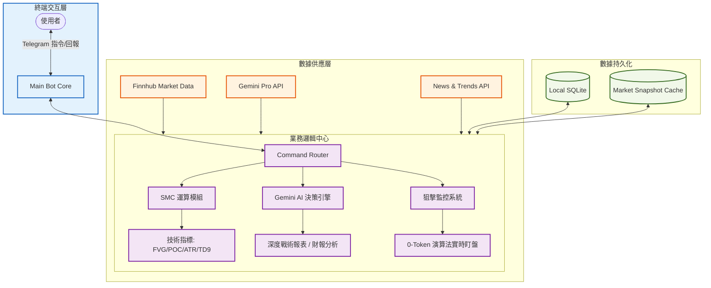

<div align="center">

# 💎 Gemini Stock Bot | 百萬作戰指揮室
---
> **您專屬的機構級 SMC & MTF 量化交易 AI 副官**

<div align="center">
  <p align="center">
    
    
    
  </p>
  <p align="center">
    <b>量化。智能。極速。</b><br>
    <i>「用 AI 為您的資產護航，在波動中尋找必然。」</i>
  </p>
</div>

---

> 🚀 **系統使命**：為美股投資者提供最強算力支持。結合 **SMC (Smart Money Concepts)**、**多時間框架 (MTF)** 與 **演算法監控**，打造一個具備極致效率、精準偵測與資產防禦能力的交易決策中樞。

</div>

---

## 🏛️ 核心技術架構 (Core Architecture)



---

## 💎 卓越進階功能 (Premium Features)

### 🧲 SMC 聰明錢分析引擎
本系統核心基於「聰明錢」邏輯，自動識別機構建倉與洗盤行為：
*   **[ FVG 偵測 ]** 自動識別 K 線失衡區域（Fair Value Gap），鎖定價格回踩的「磁鐵位」，支援看漲/看跌 FVG 雙向偵測。
*   **[ 流動性掃蕩 ]** 監控主力刻意跌破前低或突破前高行為，捕捉高勝率反轉訊號（Liquidity Sweep）。
*   **[ MTF 協同 ]** 1D 定向、4H 找結構、1H 抓觸發，完成多時區共振分析。
*   **[ POC 控制點 ]** 精準定位近 30 日「機構成本中心」，作為關鍵支撐/壓力參考。

### 📍 量化戰術指標系統
*   **EMA 多空排列**：自動判斷 21/60/200 均線排列狀態（多頭排列/空頭排列/均線糾結）。
*   **POC (Point of Control)**：精準定位「機構成本中心」，基於成交量分佈計算。
*   **Whale Tracking**：動態追蹤爆量倍率，區分機構建倉與散戶震盪（大買/中買/小買/中立/小賣/中賣/大賣）。
*   **Attack Gauge**：0-10 分戰鬥評級，綜合 EMA、MACD、RSI、VWAP 一眼看穿多空力道。
*   **TD9 序列**：內建 Tom DeMark 偵測，預警趨勢頂底部（支援 TD9/TD9+ 完整序列）。
*   **ATR 動態風險**：即時計算真實波動幅度（ATR14），作為停損與進場的絕對防禦指標。
*   **MACD 動能分析**：金叉/死叉判斷，搭配柱狀圖動能增強/減弱評估。
*   **RSI 超買超賣**：14 週期 RSI 指標，精準判斷市場情緒。
*   **VWAP 成本線**：20 日成交量加權平均價，判斷當前價格相對位置。
*   **OBV 資金流向**：累積成交量指標，追蹤資金進出動向。

### 💰 智能目標管理 (Take Profit & Stop Loss)
*   **自動目標位**：基於 ATR 與斐波那契擴展，自動產出三級獲利目標：
    - **TP1**：ATR 2 倍目標位
    - **TP2**：ATR 3 倍目標位
    - **TP_Fib**：斐波那契 1.272 擴展位
*   **精確支撐壓力**：優化後的 20 日 Swing Highs/Lows 計算，提供最實戰的價格邊界。
*   **斐波那契回撤**：自動計算 0.382、0.618、1.618 關鍵位置。

### 🛡️ 恐慌指數濾網 (VIX Filter)
**「系統性風險自動防禦」**：當 VIX > 25 時，AI 自動啟動「保守模式」，強制降級買入訊號，嚴防崩盤。所有分析報告都會標註 VIX 狀態（正常/恐慌）。

---

## 🎯 狙擊監控系統 (Sniper System)

> [!TIP]
> ### 🛡️ 核心競爭力：0-Token 背景盯盤
> 我們不使用 AI 進行無意義的迴圈消耗。採用**「演算法監控 + AI 觸發」**架構，確保系統在極低成本下維持最高頻率的監控：
> 
> 1.  **動態預算**：系統啟動時精確計算 FVG/Sweep 監控區間。
> 2.  **純量運算**：使用 Python 純演算法比對現價，**Token 消耗為 0**。
> 3.  **精準打擊**：僅在價格命中關鍵流動性區間時，才呼叫 Gemini Pro 進行戰術分析。
> 4.  **智能休眠**：市場未開盤時自動休眠，開盤時段每 30 秒掃描一次。
> 5.  **連線韌性**：具備自動重試機制與 Header 偽裝，防範 API 頻率限制。
> 6.  **每日重置**：每日 00:00 自動清空已發送警報記錄，確保不漏接任何訊號。

**狙擊觸發條件**：
*   價格進入 FVG 區間（看漲/看跌 FVG）
*   偵測到流動性掃蕩（掃低/掃高）
*   命中時立即推送完整 SMC 戰術報表

---

## 🤖 AI 智能核心 (Gemini Brain)

### 雙模型架構
*   **Flash 模式**：反應速度快，適合日常查詢與初步分析（gemini-2.0-flash-exp）
*   **Pro 模式**：分析深度高，適合複雜市場情境與戰術研究（gemini-1.5-pro）
*   **自動 Fallback**：多層備援機制，確保服務穩定性

### AI 人格設定
*   **機構級 SMC 交易副官**：冷靜、精準、專業
*   **原子化輸出**：情報與分析精煉直接，嚴禁廢話
*   **深度分析**：優先提供新聞深度摘要、核心催化劑、領頭羊公司動態、供應鏈風險
*   **標準輸出模板**：市場情報速遞 → 多時區量化儀表板 → 戰術決策

### 智能新聞路由
*   **財報模式**：自動偵測財報關鍵字，提取 EPS、營收、Guidance
*   **科技新聞模式**：分析產業趨勢、技術護城河、供應鏈影響
*   **多源整合**：NewsAPI + Yahoo Finance + RSS 科技新聞

### Token 配額管理
*   **每日配額追蹤**：精確記錄每次 API 調用的 Token 消耗
*   **智能警報**：80%、90%、100% 三級流量預警
*   **詳細審計日誌**：完整記錄每次調用的時間、模型、Token 數、URLs
*   **自動清理**：每 4 天自動清除審計日誌，保持系統效能

---

## 📟 官方指揮手冊 (Command Manual)

### 📈 技術分析與量化作戰 (`/tech`)
*   **⚡ 單標的深度報告**：`/tech [代號]`  
    > 產出完整 SMC 儀表板，包含 **FVG**、**POC**、**ATR**、**TP 獲利目標**、**進攻評級**、**主力籌碼**、**TD9 序列**等 15+ 項專業指標。
*   **🔍 多標的快速掃描**：`/tech [代號1] [代號2] [代號3]`  
    > 一次獲取最多 3 支股票的詳細技術儀表板，批量分析。
*   **⚔️ 橫向結構對比**：`/tech compare [A] [B] [C]`  
    > 分析多標的結構優劣，找出最強領頭羊，搭配 AI 戰術評析。
*   **📚 使用說明**：`/tech help`  
    > 查看完整的技術分析指令說明。

### 🤖 AI 深度分析
*   **🧠 深度戰術拆解**：`/ask [代號] [問題]`  
    > 針對特定標的進行 1v1 戰術拆解，結合最新新聞與量化指標。
*   **💬 自然語言對話**：直接輸入文字或股票代號  
    > AI 自動偵測股票代號並切換為深度分析模式，或進行一般對話。

### 📰 新聞與情報系統
*   **📰 智能新聞解讀**：`/news` 或 `/news [代號/主題]`  
    > 自動推播（持股 > 監控 > 宏觀），或查詢特定標的/主題新聞。
    > 智能路由：自動偵測財報新聞並切換為財報快訊模式。
*   **🚀 產業趨勢速報**：`/theme [主題]`  
    > 支援主題：核能、AI、半導體、電動車、生技等。
    > 產出產業情緒分數、技術突破影響、SMC 結構評估。
*   **📋 新聞源清單**：`/news list`  
    > 查看目前支援的新聞來源。

### 📊 財務分析
*   **📊 個股財報**：`/fin [代號]`  
    > 完整財務數據：EPS、P/E、營收、淨利、毛利率、淨利率、52 週高低、最新季度數據。
*   **⚔️ 財務對比**：`/fin compare [代號1] [代號2] [代號3]`  
    > 橫向比較多支股票的財務健康度，搭配 AI 深度評析與最新新聞。

### 📋 資產管理 (FIFO 自動結算)
*   **📋 /list** — **持股明細**：詳細盈虧、市值與平均成本，支援分頁瀏覽（每頁 6 筆）。
*   **💰 /buy [代號] [價格] [股數]** — **買入記錄**：記錄買入交易。
*   **💸 /sell [代號] [價格] [股數]** — **賣出記錄**：FIFO 自動結算已實現損益。
*   **👀 /watch** — **關注雷達**：管理追蹤名單，重要消息推送。
    - `/watch add [代號1] [代號2]` — 批次新增
    - `/watch del [代號1] [代號2]` — 批次移除
    - `/watch list` — 查看清單
    - `/watch clear` — 清空清單

### 🎯 狙擊管理
*   **🎯 /sweep add [代號1] [代號2]** — 將標的加入狙擊監控，啟動 FVG/Sweep 實時掃描。
*   **🎯 /sweep list** — 查看正在 24/7 監控的狙擊目標。
*   **🎯 /sweep del [代號1] [代號2]** — 批次移除狙擊目標。
*   **🎯 /sweep clear** — 清空狙擊清單。

### ⚡ 即時全景
*   **⚡ /now** — **即時全景 + 總損益**  
    > 宏觀即時觀測（標普500、納斯達克、黃金、原油、比特幣、VIX）
    > 斐波那契位置參考、當前風險評估、AI 交易副官結語

### ⚙️ 管理與系統設定
*   **🔍 /status** — 核心狀態與連線驗證  
    > 系統資源狀態、AI 連線狀態、模型偏好、運行時間
*   **💳 /quota** — API 使用配額  
    > 視覺化 Token 消耗進度、Min/Max/Avg 統計
*   **🎯 /help** — 指揮手冊  
    > 完整指令說明與使用範例

### 🔒 隱藏指令 (`/op`)
*   **🛠️ /op model [flash|pro]** — 切換快速或思考模式
*   **📊 /op quota** — 視覺化 Token 消耗進度
*   **🔒 /op log** — 系統審計日誌與錯誤回報
*   **🧹 /op log clear** — 清除系統審計日誌
*   **❓ /op help** — 隱藏功能清單

---

## 🔄 自動化推播系統

### 📢 智能推播機制
*   **⏰ 每小時新聞推播**：自動推送宏觀市場、持股、監控清單的最新新聞（優先級：持股 > 監控 > 宏觀）
*   **🔔 重大新聞快訊**：每 10 分鐘掃描監控清單，即時推送重大新聞（自動去重）
*   **🔔 開盤前匯報**：美股開盤前 30 分鐘（09:00 ET）自動推送全景分析與焦點新聞
*   **🏁 收盤後匯報**：美股收盤後 30 分鐘（16:30 ET）自動推送持股結算與市場總結

### 🧹 系統自癒
*   **每 4 天自動清理審計日誌**，保持系統極致效能
*   **狙擊警報每日重置**，確保不漏接任何訊號
*   **自動重連機制**，Polling 失敗自動重試

---

## 🚀 快速安裝與啟動 (Quick Start)

### 1. 環境需求
```bash
# Python 3.10+ 必須
python --version

# 安裝依賴套件
pip install -r requirements.txt
```

### 2. 設定環境變數
建立 `.env` 檔案並填入以下資訊：
```env
# Telegram Bot Token (必填)
TELEGRAM_TOKEN=您的_Telegram_Bot_Token

# Google Gemini API Key (必填)
GOOGLE_API_KEY=您的_Gemini_API_Key

# Finnhub API Key (必填，用於市場數據)
FINNHUB_KEY=您的_Finnhub_API_Key

# NewsAPI Key (必填，用於新聞推送)
NEWS_API_KEY=您的_NewsAPI_Key

# 管理員 Telegram Chat ID (必填，用於系統通知)
CHAT_ID=您的_Telegram_Chat_ID

# Token 配額設定 (選填，預設 1,500,000)
DAILY_TOKEN_LIMIT=1500000

# 狙擊監控間隔 (選填，預設 30 秒)
SNIPER_CHECK_INTERVAL=30
```

### 3. 啟動機器人
```bash
python main_bot.py
```

### 4. 驗證啟動
機器人啟動後會自動發送啟動通知到管理員 Chat ID，包含：
*   系統狀態檢查
*   CPU/RAM/硬碟使用率
*   AI 核心連線狀態
*   可用模型清單
*   運行時間

---

## 📊 核心模組說明

### 檔案結構
```
gemini_stock_bot_full/
├── main_bot.py          # Telegram Bot 主程式與指令路由
├── command.py           # 所有指令的業務邏輯實作
├── ai_core.py           # AI 思考層與 Prompt 模板
├── brain.py             # Gemini API 通訊核心
├── tech_indicators.py   # 量化指標計算引擎
├── market_api.py        # 市場數據 API 整合
├── database.py          # SQLite 資料庫操作
├── frame.py             # 訊息格式化與排版
├── config.py            # 系統配置與常數
├── utils.py             # 工具函數
└── .env                 # 環境變數配置
```

### 核心技術棧
*   **AI 引擎**：Google Gemini 2.0 Flash / Gemini 1.5 Pro
*   **Telegram Bot**：pyTelegramBotAPI (telebot)
*   **市場數據**：yfinance + Finnhub API
*   **新聞來源**：NewsAPI + Yahoo Finance + RSS
*   **資料庫**：SQLite3
*   **量化計算**：pandas + numpy
*   **多執行緒**：threading (自動推播、狙擊監控、市場報告)

---

## 🎓 進階功能說明

### SMC 核心概念
*   **FVG (Fair Value Gap)**：K 線之間的價格缺口，代表市場失衡，價格有回補傾向
*   **流動性掃蕩 (Liquidity Sweep)**：主力刻意觸發止損單後反向拉升/下殺
*   **POC (Point of Control)**：成交量最大的價格位，代表機構成本中心
*   **多時間框架 (MTF)**：1D 看方向、4H 找結構、1H 抓進場

### 量化指標解讀
*   **Attack Gauge**：綜合評分系統
    - 大買/中買/小買：多頭訊號（建議進場）
    - 觀察：中立（等待更明確訊號）
    - 小賣/中賣/大賣：空頭訊號（建議避險）
*   **Whale Volume**：主力籌碼追蹤
    - 大買 (>2.5x)：機構大量建倉
    - 中買 (1.5-2.5x)：機構中度建倉
    - 小買 (1.2-1.5x)：機構小量建倉
*   **TD9 序列**：
    - TD9：強反轉預期（關鍵訊號）
    - TD9+：超強反轉預期（極端訊號）

---

## 🛡️ 風險管理機制

### VIX 恐慌指數濾網
*   VIX > 25：自動啟動保守模式
*   所有「大買」訊號降級為「觀察」
*   縮小建議進場區間
*   強制加註風險警語

### ATR 動態停損
*   自動計算 ATR 2 倍作為防守價格
*   根據市場波動度調整停損位置
*   避免過緊或過鬆的停損設定

### Token 配額保護
*   每日配額上限保護
*   三級流量預警（80%、90%、100%）
*   429 錯誤自動通知管理員
*   詳細 Token 消耗統計

---

## 📈 使用範例

### 技術分析
```
/tech NVDA
→ 完整 SMC 儀表板，包含 FVG、POC、ATR、TP 目標等

/tech AAPL MSFT GOOGL
→ 批量分析三支股票

/tech compare NVDA AMD INTC
→ 橫向對比 + AI 戰術評析
```

### 新聞與情報
```
/news
→ 自動推播（持股 > 監控 > 宏觀）

/news TSLA
→ 查詢 TSLA 最新新聞 + AI 智能解讀

/theme AI
→ AI 產業趨勢速報
```

### 狙擊監控
```
/sweep add NVDA TSLA
→ 加入狙擊清單，24/7 監控 FVG/Sweep

/sweep list
→ 查看監控中的標的

當價格命中 FVG 或發生流動性掃蕩時，自動推送：
🚨 **【狙擊手警報：NVDA】**
結構共振：進入看漲 FVG
[完整 SMC 戰術報表]
```

---

<div align="center">

## 🌟 系統特色總結

**🤖 智能自動推播**：每小時推送行情；美股開盤/收盤提供專項匯報。  
**🎯 0-Token 狙擊**：演算法監控 + AI 觸發，極低成本實現 24/7 盯盤。  
**🧠 雙模型架構**：Flash 快速響應 + Pro 深度分析，自動 Fallback。  
**📊 15+ 量化指標**：EMA、MACD、RSI、ATR、TD9、POC、FVG、VWAP、OBV 等。  
**🛡️ VIX 濾網**：系統性風險自動防禦，恐慌時強制保守。  
**🧹 系統自癒**：每 4 天自動清理審計日誌，保持系統極致效能。  
**📰 智能新聞路由**：自動偵測財報/科技新聞，切換分析模式。  
**💰 FIFO 結算**：自動計算已實現損益，精確資產管理。

---

**⚖️ 免責聲明**：本工具僅供學術研究與數據參考，**不構成任何投資建議**。市場有風險，交易需謹慎。

---

**📧 技術支援**：如有問題或建議，請使用 `/reportbug` 指令回報。

**🔗 GitHub**：[Telegram_Stock_Bot](https://github.com/kevinp12/Telegram_Stock_Bot)

---

<p align="center">
  <b>Built with ❤️ by Kevin | Powered by Google Gemini AI</b>
</p>

