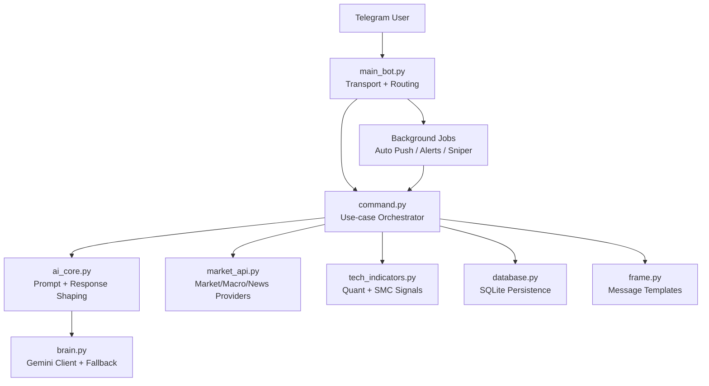
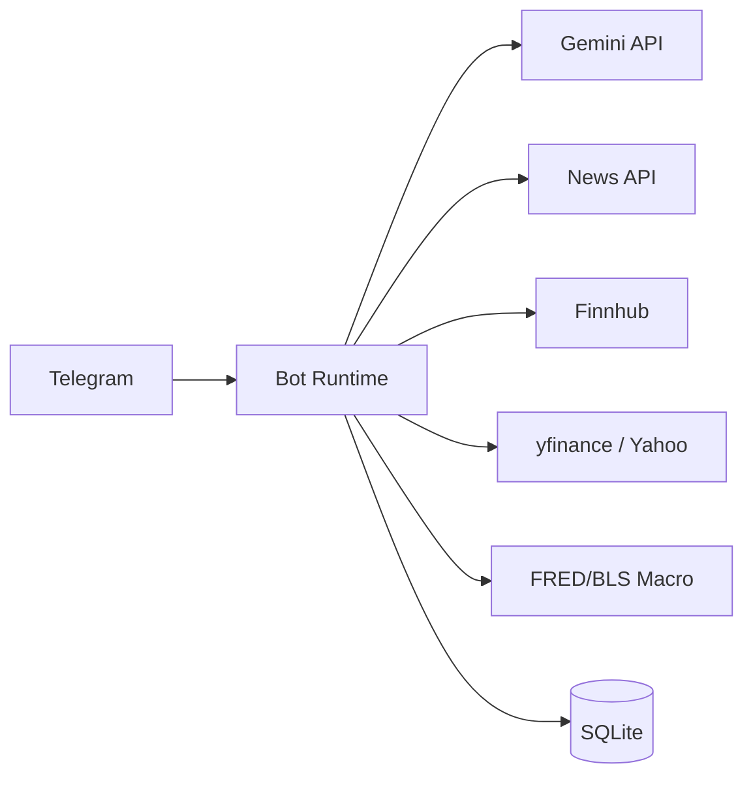
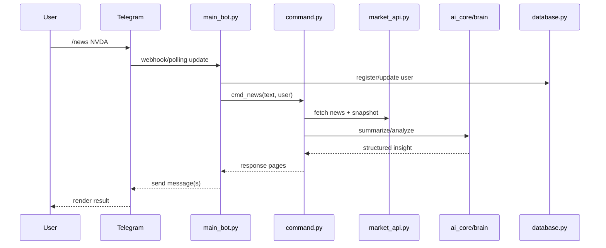
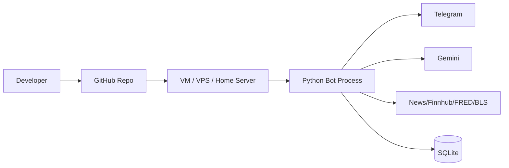

<div align="center">

# 🧠 Gemini Stock Bot
### *Telegram Quant Assistant for US Equities*

[](https://www.python.org/)
[](https://core.telegram.org/bots)
[](https://ai.google.dev/)
[](https://www.sqlite.org/index.html)
[](#)

**一個兼具交易資訊聚合、風險監控、投資問答與持倉管理的工程化 AI 助手。**

</div>

---

## ✨ Product Vision

Gemini Stock Bot 的核心定位是：

> 讓使用者在 Telegram 內，以低摩擦方式完成「市場觀測 → 深度分析 → 風險判讀 → 決策執行」閉環。

它不是單一聊天機器人，而是由多模組組成的 **量化資訊中樞**：

- **Macro Layer**：宏觀與風險因子（CPI / PCE / VIX / DXY / US10Y / 情緒指標）
- **Market Layer**：價格、新聞、題材、機構/內部人動向
- **Decision Layer**：LLM 驅動的結構化分析與戰術解讀
- **Execution Layer**：持倉紀錄、監控推播、狙擊任務

---

## 🧱 System Architecture

## 1) Logical Architecture



## 2) Runtime Topology



## 3) Interaction Sequence (User → AI Response)



---

## 🖼️ Product Preview (Placeholders)

> 你可以把以下檔案放在 `docs/assets/`，README 會自動呈現高質感展示。

| View | Preview |
|---|---|
| `/status` 系統狀態 | `` |
| `/risk` 風險儀表板 | `` |
| `/marco` 宏觀雷達 | `` |
| `/tech` 技術儀表板 | `` |

> 範例（啟用後）：
>
> ```md
> 
> ```

---

## 🗂️ Repository Structure

```text
gemini_stock_bot_full/
├── main_bot.py          # Telegram handler、callback、背景工作排程
├── command.py           # 指令業務流程（核心 orchestrator）
├── ai_core.py           # Prompt 策略、AI 模式切換、回覆整形
├── brain.py             # Gemini 呼叫、fallback、狀態統計
├── market_api.py        # 新聞/行情/宏觀資料整合
├── tech_indicators.py   # 技術指標與結構訊號
├── database.py          # SQLite CRUD、使用者/交易/日誌
├── frame.py             # 輸出格式模板（排版層）
├── config.py            # 環境變數與設定
├── utils.py             # 共用工具
├── docs/
│   └── COMMANDS.md      # 指令維運手冊
└── README.md
```

---

## 🚀 Features

## A. Market Intelligence
- `/now`：即時市場全景（大盤 + 斐波參考 + AI 結語）
- `/news [symbol/topic]`：新聞摘要 + AI 分析
- `/risk`：風險雷達（VIX、恐貪、期權、社群熱度）
- `/marco`：宏觀雷達（數據頁 + 教學頁）

## B. Deep Analysis
- `/tech [symbol]`：技術結構與訊號
- `/tech [symbol]`：除文字分析外，額外回傳 SMC + TD 戰術 K 線圖（90天計算、60天顯示）
- `/chart [symbol]`：直接輸出戰術圖
- `/chart [symbol] [dark|light]`：單次指定圖表主題
- `/chart theme [dark|light]`：設定後續圖表預設主題
- `/tech compare A B [C]`：多標的技術面比較（AI 失敗時自動 fallback 至比較報表）
- `/fin [symbol]`：財報與估值快照
- `/fin compare A B [C]`：多標的比較
- `/whale [symbol]`：內部人/機構動向
- `/ask [symbol] [question]`：任意深度問答

## C. Portfolio & Automation
- `/buy` `/sell` `/list`：持倉管理（FIFO）
- `/watch add|del|list|clear`：追蹤清單
- `/sweep add|del|list|clear`：狙擊清單
- `/bc on|off|timer`：自動推播控制

## D. Ops & Governance
- `/status`：系統狀態與資源
- `/quota`：Token 使用量
- `/ulog [page] [id/name]`：管理者快速查詢 user.log（7天、分頁）
- `/op ...`：管理員隱藏指令

---

## 📡 Command Surface (Quick View)

| Domain | Commands |
|---|---|
| Market | `/now`, `/risk`, `/marco`, `/news` |
| Analysis | `/tech`, `/chart`, `/chart theme`, `/tech compare`, `/fin`, `/fin compare`, `/whale`, `/ask` |
| Portfolio | `/buy`, `/sell`, `/list`, `/watch ...`, `/sweep ...` |
| System | `/status`, `/quota`, `/bc ...`, `/help`, `/op ...`, `/ulog ...` |

更完整的映射請見：[`docs/COMMANDS.md`](docs/COMMANDS.md)

---

## ⚙️ Installation

## 1) Environment

- Python **3.10+**
- macOS / Linux / WSL（皆可）

## 2) Setup

```bash
python3 -m venv .venv
source .venv/bin/activate
pip install -r requirements.txt
```

## 3) Configure `.env`

```env
# Telegram
TELEGRAM_TOKEN=xxx
ADMIN_ID=123456789

# LLM
GEMINI_API_KEY=xxx

# Data providers
NEWS_API_KEY=xxx
FINNHUB_KEY=xxx
FRED_API_KEY=xxx
BLS_API_KEY=xxx

# Runtime
DB_NAME=sniper_trades.db
DAILY_TOKEN_LIMIT=500000
SNIPER_CHECK_INTERVAL=300
MAX_TELEGRAM_MESSAGE_LENGTH=3500
```

## 4) Run

```bash
python3 main_bot.py
```

---

## 🔄 Background Jobs

啟動後會建立多個 daemon 工作：

1. **auto_news_job**：依使用者設定頻率推播
2. **major_news_alert_job**：watchlist 重大新聞提醒
3. **market_report_job**：開盤前 / 收盤後報告
4. **sniper_alert_job**：狙擊訊號監控
5. **log_cleanup_job**：審計日誌定期清理

---

## 🧪 Quality & Validation

推薦最少驗證：

```bash
python3 -m py_compile main_bot.py command.py frame.py market_api.py ai_core.py brain.py database.py tech_indicators.py utils.py config.py
```

如果需進一步擴充，建議加入：
- `ruff` / `flake8`：靜態規範
- `mypy`：型別檢查
- `pytest`：行為測試

### /tech 圖表生成備註

- 圖表引擎：`mplfinance`
- 效能策略：
  - 使用 `io.BytesIO()`，不落地檔案
  - `mpf.plot(..., closefig=True)` 強制釋放畫布
  - Telegram 發送採 `try...finally`，在 `finally` 內 `buf.close()`

### /chart 指令教學與錯誤回覆

- 正常用法：
  - `/chart NVDA`
  - `/chart NVDA dark`
  - `/chart NVDA light`
  - `/chart theme dark`
  - `/chart theme light`
- 若 `/chart` 未帶代號，bot 會自動回覆教學訊息。
- 若代號格式錯誤（非英數），bot 會回覆錯誤提示並給範例。

---

## 🔐 Security Notes

- 所有金鑰皆放在 `.env`，不要提交到 Git
- `/op` 僅授權 `ADMIN_ID`
- 若接外部 webhook 或 dashboard，請加上 IP allowlist / token 驗證

---

## 🛠️ Engineering Conventions

本專案已採用以下實務方向：

- 業務邏輯集中於 `command.py`（用例層）
- 輸出樣式集中於 `frame.py`（展示層）
- 透過 `run_with_loading(...)` 減少 handler 重複流程
- README 與 `docs/COMMANDS.md` 作為維運文檔基線

## 🧭 Design Principles

1. **Separation of Concerns**
   - `main_bot.py` 專注 Transport/Handler
   - `command.py` 專注 Use-case orchestration
   - `frame.py` 專注輸出排版

2. **Operational Resilience**
   - 背景任務以 daemon thread 執行
   - 重要流程具備 fallback 與錯誤包裝

3. **Readable by Default**
   - 指令回覆採分頁與區塊化設計
   - 文件先描述系統邏輯，再描述操作細節

---

## 🏗️ Deployment Topology (Suggested)



建議：
- 使用 `systemd` 或 `supervisord` 管理常駐程序
- log rotate 避免日誌無限膨脹
- `.env` 僅在主機保存，不上傳版本庫

---

## 📈 Observability Checklist

- [x] `/status` 可看核心健康度
- [x] `/quota` 可看每日 token 消耗
- [x] background jobs 具 logging 訊息
- [ ] 建議後續加入 Prometheus/Grafana（若走雲端部署）
- [ ] 建議加入錯誤碼分桶統計（429/5xx/timeout）

---

## 🗺️ Roadmap (Suggested)

- [ ] 把 `command.py` 進一步拆成 domain modules（market / portfolio / admin）
- [ ] 建立測試資料夾與最小 pytest 套件
- [ ] 加入 API response cache 與 retry policy metrics
- [ ] 建立 CHANGELOG 與 release tag 流程

---

## ⚠️ Disclaimer

本專案僅供研究與教育用途，不構成投資建議。  
請自行承擔投資風險。

---

<div align="center">

### Built with discipline, data, and engineering aesthetics ⚙️

</div>
