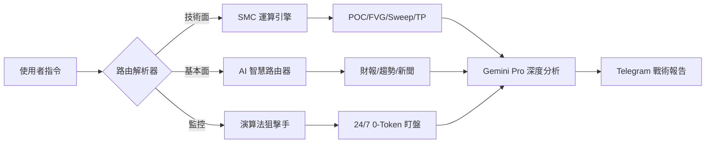

<div align="center">

# 💎 Gemini Stock Bot | 百萬作戰指揮室
---
> **您專屬的機構級 SMC & MTF 量化交易 AI 副官**


[]()
[]()
[]()
[]()

---

> 🚀 **系統使命**：為美股投資者提供最強算力支持。結合 **SMC (Smart Money Concepts)**、**多時間框架 (MTF)** 與 **演算法監控**，打造一個具備極致效率、精準偵測與資產防禦能力的交易決策中樞。

</div>

---

## 🏛️ 核心技術架構 (Core Architecture)



---

## 💎 卓越進階功能 (Premium Features)

### 🧲 SMC 聰明錢分析引擎
本系統核心基於「聰明錢」邏輯，自動識別機構建倉與洗盤行為：
> **[ FVG 偵測 ]** 自動識別 K 線失衡區域，鎖定價格回踩的「磁鐵位」。  
> **[ 流動性掃蕩 ]** 監控主力刻意跌破前低或突破前高行為，捕捉高勝率反轉訊號。  
> **[ MTF 協同 ]** 1D 定向、4H 找結構、1H 抓觸發，完成多時區共振。

### 📍 量化戰術指標
*   **POC (Point of Control)**：精準定位「機構成本中心」。
*   **Whale Tracking**：動態追蹤爆量倍率，區分機構建倉與散戶震盪。
*   **Attack Gauge**：0-10 分戰鬥評級，一眼看穿多空力道。
*   **TD9 序列**：內建 Tom DeMark 偵測，預警趨勢頂底部。
*   **ATR 動態風險**：即時計算真實波動幅度，作為停損與進場的絕對防禦指標。

### 💰 智能目標管理 (Take Profit & Stop Loss)
*   **自動目標位**：基於 ATR 與 斐波那契擴展，自動產出三級獲利目標 (TP1, TP2, TP_Fib)。
*   **精確支撐壓力**：優化後的 20 日 Swing Highs/Lows 計算，提供最實戰的價格邊界。

### 🛡️ 恐慌指數濾網 (VIX Filter)
**「系統性風險自動防禦」**：當 VIX > 25 時，AI 自動啟動「保守模式」，強制降級買入訊號，嚴防崩盤。

---

## 🎯 狙擊監控系統 (Sniper System)

<div align="center">

</div>

### 🛡️ 降維打擊：0 Token 背景盯盤
我們不使用 AI 進行無意義的迴圈消耗。採用**「演算法監控 + AI 觸發」**架構：
1.  **一次性計算**：計算 FVG/Sweep 監控區間。
2.  **演算法盯盤**：Python 純演算法比對現價，**Token 消耗為 0**。
3.  **命中報警**：命中區間時才呼叫 AI 產出正式狙擊報表。
4.  **API 安全**：批次請求 + Header 偽裝，防範 IP 封鎖。

---

## 📟 官方指揮手冊 (Command Manual)

### 📈 技術分析與量化作戰 (`/tech`)
*   **⚡ 單指標深度報報**：`/tech [代號]`  
    > 產出完整 SMC 儀表板，包含 **FVG**、**POC**、**ATR**、**TP 獲利目標**與**進攻評級**。
*   **🔍 多標的快速掃描**：`/tech [代號1] [代號2] [代號3]`  
    > 一次獲取最多 3 支股票的詳細技術儀表板。
*   **⚔️ 橫向結構對比**：`/tech compare [A] [B]`  
    > 分析多標的結構優劣，找出最強領頭羊。
*   **🧠 深度戰術拆解**：`/ask [代號] [問題]`  
    > 針對特定標的進行 1v1 戰術拆解。

### 📋 資產管理 (FIFO 自動結算)
*   **📋 /list** — **持股明細**：詳細盈虧、市值與平均成本。
*   **💰 /buy / /sell** — **交易記錄**：FIFO 自動結算已實現損益。
*   **👀 /watch** — **關注雷達**：管理追蹤名單，重要消息推送。

### 🎯 狙擊管理
*   **🎯 /sweep add** — 將標的加入狙擊監控，啟動 FVG/Sweep 實時掃描。
*   **🎯 /sweep list** — 查看正在 24/7 監控的狙擊目標。

---

## ⚙️ 管理與系統設定 (`/op`)
*   `🛠️ /op model [flash|pro]` — 切換快速或思考模式。
*   `📊 /op quota` — 視覺化 Token 消耗進度。
*   `🔒 /op log` — 系統審計日誌與錯誤回報。
*   `🔍 /status` — 核心狀態與連線驗證。

---

## 🚀 快速安裝與啟動 (Quick Start)

### 1. 安裝環境
```bash
# 安裝 Python 3.10+
pip install -r requirements.txt
```

### 2. 設定環境變數
建立 `.env` 檔案並填入以下資訊：
```env
TELEGRAM_TOKEN=您的_Telegram_Token
GOOGLE_API_KEY=您的_Gemini_API_Key
FINNHUB_KEY=您的_Finnhub_Key
NEWS_API_KEY=您的_NewsAPI_Key
CHAT_ID=管理員_Telegram_ID
```

### 3. 啟動機器人
```bash
python main_bot.py
```

---

<div align="center">

**🤖 智能自動推播**：每小時推送行情；美股開盤/收盤提供專項匯報。  
**🧹 系統自癒**：每 4 天自動清理審計日誌，保持系統極致效能。

**⚖️ 免責聲明**：本工具僅供學術研究與數據參考，**不構成任何投資建議**。市場有風險，交易需謹認。

</div>
