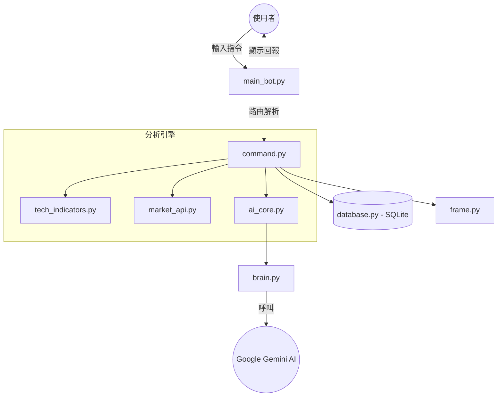

<div align="center">

# 🎯 Gemini Stock Bot | 百萬作戰指揮室
---
> *您的專屬 AI 投資副官*

[]()
[]()
[]()

</div>

---

> 🚀 **系統使命**：為美股投資者提供最冷靜的 AI 戰術分析、即時量化指標與精準的市場情報決策。

---

## 🛰️ 系統架構流向 (Architectural Flow)



---

## 🛠️ 模組結構 (Modules Overview)

<details>
<summary><b>📂 點擊查看核心架構邏輯</b></summary>

| 模組 | 職責 |
| :--- | :--- |
| `main_bot.py` | 系統入口，Telegram API 對接、自動化任務排程。 |
| `command.py` | 業務邏輯樞紐，處理所有指令行為與報表生成。 |
| `ai_core.py` | AI 決策核心，轉換原始資料為戰術分析與投資建議。 |
| `brain.py` | Gemini API 底層通訊，處理自動 Fallback、Token 統計與日誌。 |
| `tech_indicators.py` | 量化分析運算 (均線、動能、TD9、斐波那契)。 |
| `market_api.py` | 市場資訊採集 (Yahoo Finance, Finnhub, NewsAPI)。 |
| `database.py` | 資料持久化，記錄持股、帳務與 Token 使用。 |
| `frame.py` | 排版與視覺格式中心，優化 Telegram 介面體驗。 |

</details>

---

## 📟 指令速查表 (Command Cheat Sheet)

### 📈 技術分析與戰術
*   `/tech [代號]` — 產出專業量化儀表板 (EMA, MACD, TD9, VWAP)。
*   `/tech compare [A] [B]` — 橫向對比分析，給出 AI 交易建議。
*   `/fin [代號]` — 個股財報、EPS 與核心估值。
*   `/fin compare [A] [B]` — QoQ 季增長對比，判斷財報基本面。
*   `/ask [代號] [問題]` — Pro 級 AI 深度戰術諮詢。

### 📰 市場情報
*   `/news` — 執行全市場新聞摘要。
*   `/now` — 即時盤勢全景、總損益與 AI 短評。
*   `/theme [主題]` — 產業趨勢速報 (AI, 半導體, 核能)。

### 📋 資產管理
*   `/list` — 持股明細與盈虧分析。
*   `/buy /sell` — 交易紀錄 (FIFO 自動結算)。
*   `/watch [add/del/list]` — 管理關注雷達名單。

---

## 🚀 環境安裝 (Environment Setup)

在開始前，請確保您的系統已安裝 **Python 3.10+**。

### 1. 準備工作
建議使用虛擬環境來安裝依賴：
```bash
# 建立虛擬環境
python -m venv .venv
# 啟用虛擬環境 (macOS/Linux)
source .venv/bin/activate

# 安裝所需插件 (Dependencies)
pip install -r requirements.txt
```

### 2. 設定環境變數
請建立 `.env` 檔案並填入必要的 API Keys：
```bash
cp .env.example .env
# 請編輯 .env 填入以下內容：
# TELEGRAM_BOT_TOKEN=...
# GOOGLE_API_KEY=...
# FINNHUB_API_KEY=...
```

### 🛠️ 使用的插件 (Libraries)
本專案使用以下 Python 模組：
*   **pyTelegramBotAPI**: Telegram Bot 框架
*   **google-genai**: Gemini AI 介面
*   **yfinance / finnhub-python**: 財務數據獲取
*   **pandas**: 資料處理與分析
*   **python-dotenv**: 環境變數管理
*   **requests / feedparser**: 網路請求與新聞解析
*   **psutil**: 系統資源監控

---


> 🤖 **智能自動推播**：每 **1 小時** 自動推送情報 (開盤時間 `09:30-16:00 ET` 暫停)。
> 🧹 **系統自癒**：每 **4 天** 自動執行日誌清理，確保效能。
> 💎 **配額警報**：Token 消耗達到 80%/90%/100% 時，自動推送預警。

### 🕵️ 隱藏功能指令 (`/op`)
*   `/op model [flash\|pro]` — 切換 AI 模型核心。
*   `/op log` — 查看最近 40 筆審計日誌。
*   `/op log clear` — 手動清除日誌。
*   `/op quota` — 查詢今日 Token 使用進度。

---

<div align="center">

**⚖️ 免責聲明**：本工具僅供學術研究，**不構成任何投資建議**。投資美股具有高度風險。

</div>
